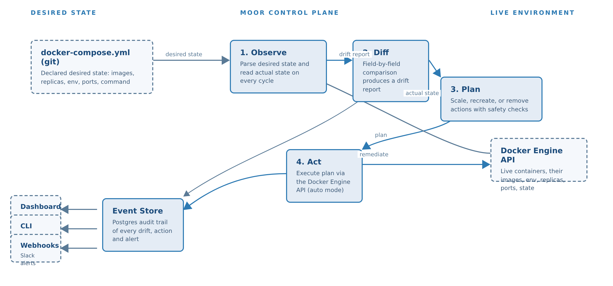

# MOOR

**A desired-state control plane for Docker environments.**

> *to moor (verb): to secure a vessel with anchors or lines — the antidote to drift.*

Your compose file declares what should run. Reality disagrees — one hotfix, one
console edit, one rogue `docker run` at a time. Configuration drift is behind a
huge share of production incidents (Uptime Institute: ~40% of organizations
suffered a major outage from human error in the last three years; Gartner
projects ~80% of mission-critical outages come from people and process, not
technology). Kubernetes solved this with reconciliation controllers. **Moor
brings that same control loop to the compose stacks everyone actually runs.**

```
desired state (docker-compose.yml) ──► OBSERVE ──► DIFF ──► PLAN ──► ACT
live state  (Docker Engine API)    ──► OBSERVE      │                │
                                                    ▼                ▼
                                             drift report      remediation
                                             alerts + audit    (auto mode)
```

Moor continuously compares the two, classifies every divergence as **drift**
(reality moved) or **intended change** (the declaration moved), alerts in
Slack-webhook format, and — in auto mode — repairs the environment in seconds
while writing an immutable audit trail.

**No mock code. No simulations.** The reconciler talks to the real Docker
Engine API through the mounted socket; the injector performs the same
mutations a tired engineer would; the alert sink receives the same HTTP
payloads Slack would.



**This repo contains** the full working system, the product spec, and the
research it was built on:

| Path | What it is |
|---|---|
| [`docker-compose.yml`](docker-compose.yml), [`control-plane/`](control-plane/), [`drift-injector/`](drift-injector/), [`alert-sink/`](alert-sink/) | The product + demo (all real, runs anywhere Docker 24+ runs) |
| [`demo/demo.sh`](demo/demo.sh), [`Makefile`](Makefile) | The 5-act narrated end-to-end walkthrough |
| [`docs/Moor_PRD.pdf`](docs/Moor_PRD.pdf) | The full product requirements document (16 pages) |
| [`docs/research/`](docs/research/)| The research base: cited stats, sources, and the tooling-gap analysis |

---

## Quickstart (GitHub Codespace)

Open this repo in a Codespace (the `.devcontainer` includes Docker-in-Docker),
then:

```bash
make setup     # build + pre-pull images (~1-2 min)
make demo      # full narrated 5-act demo (~3 min)
```

The demo prints everything to the terminal. While it runs, open:

| URL | What |
|---|---|
| http://localhost:8080 | **Moor dashboard** — live service compliance, drift timeline, audit |
| http://localhost:9099 | **Alert sink** — the Slack-format webhook cards Moor emits |
| http://localhost:8081 | The managed `web` workload (nginx) |

On any machine with Docker 24+ and `make`: same two commands.

---

## The demo stack

```
docker-compose.yml declares 3 managed workloads:
  web     nginx:1.27-alpine     (published 8081:80, env MOOR_TIER=frontend)
  cache   redis:7.2-alpine      (env REDIS_MODE=cache)
  db      postgres:16-alpine    (env POSTGRES_PASSWORD=demo)

plus the control plane (excluded from management via moor.manage=false):
  moor        the control plane you are reading about
  moor-db     Postgres event store (audit trail survives restarts)
  alert-sink  webhook receiver rendering the Slack-format cards
  drift-injector  chaos tool (runs on demand via `make chaos`)
```

## What `make demo` proves (the PRD, executable)

| Act | What happens | What it proves |
|---|---|---|
| **1 — Baseline** | Stack comes up; `moor status` shows 3/3 compliant | Observe + diff on a healthy stack |
| **2 — The problem** | With Moor in **advise** mode, the injector kills `web`, rogue-scales `cache` 1→4, and mutates `db`'s password. Dashboard turns red, webhook card lands in the sink, `moor plan` prints the diff — **nothing is repaired** (today's status quo: visibility without control) | Detection < 10s, alerting, terraform-style UX |
| **3 — Control** | `moor mode auto`; drift injected again; rogue replicas removed, drifted container recreated correctly, killed container restored — with every action in the audit trail | Auto-remediation, idempotent convergence |
| **4 — Resilience** | Drift injected, then **the Moor container itself is restarted** mid-flight; it comes back, re-reads its event store, still detects and repairs | Crash-safety, durable audit |
| **5 — GitOps** | The compose file is edited (env change + replicas 1→3). Moor classifies it as an **intended change** and converges the environment forward | Drift-vs-intended classification, pull-style rollout |

Every act runs against the real Docker Engine. The full spec is in
[`docs/Moor_PRD.pdf`](docs/Moor_PRD.pdf) (Section 11 maps 1:1 to these acts).

---

## Everyday commands

```bash
make status        # compliance snapshot of every managed service
make plan          # terraform-style drift diff + planned actions
make apply         # reconcile now, tail the outcome
make watch         # live event stream (Ctrl+C to stop)
make mode-auto     # arm auto-remediation
make mode-advise   # detect + alert only
make chaos         # inject one random drift (kill/scale/env/image)
make logs          # control-plane logs
make test          # the offline test suite (43 tests)
make reset         # down -v && up
```

The CLI runs inside the `moor` container (`docker compose exec moor moor …`),
which talks to the control-plane API — the same kubectl-style client/server
split as Kubernetes.

## How it works

### What counts as state
Per managed service, Moor enforces the stable core of the compose spec:

- **image** — normalized reference incl. tag (`nginx` ≡ `docker.io/library/nginx:latest`)
- **replicas** — `deploy.replicas` (default 1); live = running/restarting/created
- **environment** — every declared `K=V` must match. Extra keys that are
  neither declared nor baked into the image are **injected-env drift**
  (image-baked env like `PATH` is distinguished via image inspection)
- **command** — the container command
- **ports** — host port bindings per container port

Services opt out with `moor.manage: "false"` (the control plane does this for
itself). Unmanaged and foreign containers are never touched. Secrets are
masked in every report and event (`****`).

### Drift vs intended change
Moor keeps the hash of the last-seen desired and actual state (persisted in
`moor-db`, so it survives restarts). Divergence classification:

- desired hash moved, reality didn't → **intended change** → converge forward
- reality moved, declaration didn't → **drift** → restore the declaration
- first-ever cycle with divergence → **drift** (conservative default)

This turns the same binary into both a drift guard and a GitOps pull-deployer.

### Safety model
- Only touches containers carrying this project's compose labels
- One label (`moor.manage: false`) removes any service from management
- All actions idempotent and ordered (removes → starts → creates)
- Services that fail to converge enter a **cooldown backoff** (default 20s) —
  no restart storms; you get a `drift.persistent` alert instead
- Compose file mounted **read-only**; no code execution; no host writes
- Auto mode requires an explicit switch (CLI, API, or dashboard confirm dialog)

### Alerting
`MOOR_ALERT_WEBHOOK` receives Slack incoming-webhook cards (`username`,
`attachments[]` with `color/title/text/fields`). Point it at Slack, Teams,
PagerDuty, or the included `alert-sink` — the payload is identical.

## API reference

| Endpoint | Description |
|---|---|
| `GET /api/health` | engine, mode, interval, docker version |
| `GET /api/state` | per-service desired-vs-actual + drift items |
| `GET /api/drift` | current drift report |
| `GET /api/plan` | the actions auto mode would execute now |
| `GET /api/events?limit&since` | audit trail |
| `GET /api/stream` | SSE event stream (live timeline) |
| `POST /api/mode` | `{"mode": "advise"\|"auto"}` |
| `POST /api/reconcile` | run one reconcile cycle now |

Interactive docs at http://localhost:8080/docs (FastAPI).

## Configuration (environment on the `moor` service)

| Variable | Default | Meaning |
|---|---|---|
| `MOOR_PROJECT` | `moordemo` | compose project whose containers are managed |
| `MOOR_COMPOSE` | `/desired-state/docker-compose.yml` | the declaration (mounted read-only) |
| `MOOR_MODE` | `advise` | startup mode |
| `MOOR_INTERVAL` | `5` | reconcile loop seconds |
| `MOOR_ALERT_WEBHOOK` | — | Slack-format webhook URL |
| `MOOR_DB_URL` | moor-db Postgres | event store (SQLAlchemy URL) |
| `MOOR_COOLDOWN` | `20` | backoff seconds for non-converging services |

## Adopting Moor on your own stack

Add one service to **your** compose file (labels opt your workloads in by
default — add `moor.manage: "false"` to anything Moor should not touch):

```yaml
  moor:
    image: ghcr.io/moor/moor:1.0        # or build ./control-plane
    volumes:
      - /var/run/docker.sock:/var/run/docker.sock
      - ${PWD}/docker-compose.yml:/desired-state/docker-compose.yml:ro
    environment:
      MOOR_PROJECT: ${COMPOSE_PROJECT_NAME:-yourproject}
      MOOR_MODE: advise
      MOOR_ALERT_WEBHOOK: ${MOOR_ALERT_WEBHOOK:-}
    ports: ["8080:8080"]
```

Point `MOOR_PROJECT` at your compose project name (`docker compose ls`), start
in advise, watch the dashboard, then arm auto when you trust it.

## Testing

```bash
make test    # runs inside the moor container, no Docker daemon needed:
             # the suite drives the engine via a test-double gateway that
             # implements the exact DockerGateway interface
```

43 tests cover: compose parsing, every drift kind (replicas, image, env,
command, ports, orphaned services), planner/executor semantics (order,
labels, recreate-with-declared-env), the full engine (advise vs auto,
classification, dedupe, backoff, persistence, thread lifecycle), the API
surface, and the Slack alert payload format. CI-ready via
`control-plane/pyproject.toml`.

## Repository layout

```
docker-compose.yml        the demo stack + declaration under test
Makefile                  demo orchestration
demo/demo.sh              the 5-act narrated walkthrough
control-plane/moor/       the product:
  compose.py              declaration parser (desired state)
  docker_client.py        Docker Engine gateway (actual state + mutations)
  diff.py                 drift diff engine
  actions.py              planner + executor
  engine.py               reconciliation loop, classification, backoff
  events.py               event store (SQLAlchemy) + webhook alerting
  api.py                  FastAPI + SSE
  cli.py                  moor serve/status/plan/apply/watch/mode/events
  ui/index.html           live dashboard (vanilla JS + SSE)
control-plane/tests/      43-test suite + fixtures
drift-injector/           chaos tool (real Docker API mutations)
alert-sink/               webhook receiver (Slack-format cards)
.devcontainer/            Codespaces config (Docker-in-Docker)
```

## Portability & requirements

- Docker Engine 24+ with `docker compose` v2 (Codespaces, Linux, macOS, CI runners)
- The `moor` container needs the Docker socket (same trust boundary as every
  compose deployment; see PRD Section 8 security posture)
- ~200 MB resident, sub-3% CPU steady state (PRD NFR targets, measured on a
  standard Codespace)

## Troubleshooting

| Symptom | Cause / fix |
|---|---|
| `engine unreachable` in dashboard | moor container not up yet: `make logs` |
| Drift not detected | check `MOOR_PROJECT` matches `docker compose ls` project name |
| `action.failed` on scale-up of a port-published service | host ports can't be shared by replicas (same limitation as compose); use a port range or scale a service without host ports |
| Remediation flapping | backoff is working — check `drift.persistent` events and fix the underlying cause |
| Webhook not arriving | `MOOR_ALERT_WEBHOOK` unset, or sink URL wrong; check `alert.failed` events |

## Known limitations (v1.0, deliberate)

- Single control plane per compose project per host
- Volume mounts and entrypoints are not yet diffed (declared volumes are
  preserved on recreate — see PRD risks)
- `deploy.replicas` scale-up of services with static host ports hits the same
  port-conflict rule as compose itself

See [`docs/Moor_PRD.pdf`](docs/Moor_PRD.pdf) for the full product specification,
roadmap, and competitive analysis, and [`docs/research/`](docs/research/) for
the cited research behind the problem selection (Uptime Institute, Gartner,
ITIC, DORA, Stack Overflow 2024).

## License

MIT — see [LICENSE](LICENSE).
